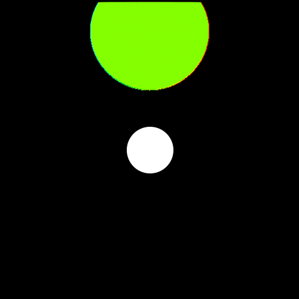

# TIPE-balle-de-golf-2024

Le thème de l'année 2024 étant le sport. J'ai décidé de baser mon étude sur la balle de golf, et plus particulièrement sur son aérodynamisme.

Nous nous intéresserons aux différents mécanismes, qui permettent aux balles de golf d'avoir un vol plus important que ce qu'elles devraient réaliser sans ces derniers.

Voici des examples de la modélisation réalisé:

