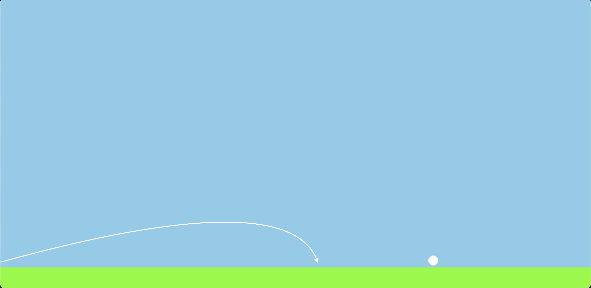
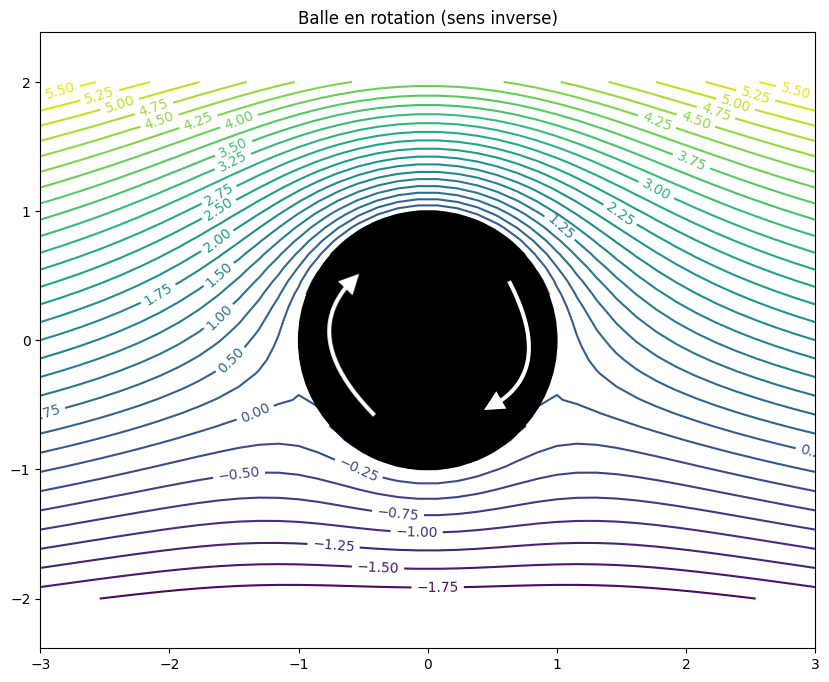
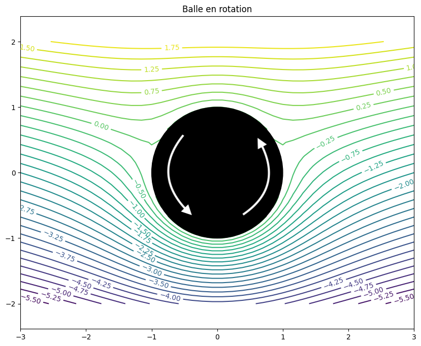
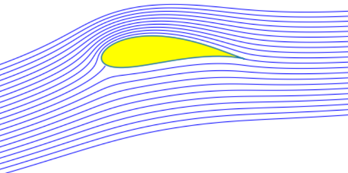
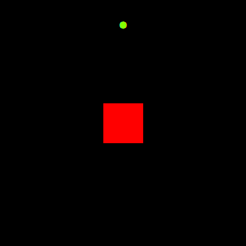

# <center><span style="font-size: 35px;">Le coup de golf parfait</span></center>

# <span style="font-size: 24px;">Présentation</span>

<blockquote>
Le golf est un sport se pratiquant sur un parcours d'un certain nombre de trous, où l'objectif pour chaque trou, est de rentrer la balle dans ce dernier en le moins de coup possible. Cependant, dans le golf, un grand nombres de paramètres peuvent influencer chaque coup.

Mis à part le swing, qui correspond au geste du golfeur et aux différents paramètres qui en dépendent. Ainsi que les facteurs environnementaux. Le principal facteur qui peut influencer le "coup de golf" est : la balle de golf.

En particulier la distance à chaque coup peut avoir une influence sur le score final de la partie, d'après la Professional Golfers' Association : chaque mètre supplémentaire de distance au drive peut potentiellement se traduire par une réduction d'environ 0,01 à 0,03 coup par trou en moyenne, le driver étant le club permettant de réaliser les plus grandes distances, et donc régulièrement utilisé pour démarrer sur un trou. Ainsi un golfeur qui gagne environ 20 mètres de distance au drive pourrait s'attendre à économiser environ 0,2 à 0,6 coup par tour
</blockquote>

## La balle de golf

<span style="font-size: 16px;">La balle de golf a été et est source de nombreuses innovations technologiques.</span>

 
<center></center>
<br>

<span style="font-size: 16px;">avec pour fer de lance la titleist Pro-V1. Pionnière dans l'évolution des balles :</span>

<center></center>
<br>

### Parmi les innovations de cette dernière:

1. Noyau Plus Performant : noyau à double noyau, ce qui signifie qu'elle comporte deux noyaux imbriqués. Le noyau interne est plus petit et plus dur, tandis que le noyau externe est plus grand et plus doux. Cette construction à double noyau permet d'obtenir un équilibre entre la vitesse et le contrôle du spin.
2. Enveloppe en Uréthane Thermoset : La Pro V1 comportait une enveloppe externe fabriquée à partir d'uréthane thermoset un polymère. Cette enveloppe offrait un toucher doux, une meilleur durabilité et une meilleure adhérence sur les greens, ce qui aidait les joueurs à mieux contrôler leurs coups roulés et leurs approches.
3. Aérodynamisme Amélioré : Les modèles Pro V1 étaient conçus avec une géométrie d'ailettes améliorée pour réduire la traînée et augmenter la portée, ce qui permettait aux golfeurs d'obtenir une meilleure distance globale et une trajectoire plus stable.
4. Contrôle du Spin : Les caractéristiques de l'enveloppe et du noyau de la Pro V1 étaient conçues pour offrir un bon équilibre entre spin élevé sur les fers et spin réduit sur les bois de départ, ce qui permettait aux golfeurs d'avoir plus de contrôle sur leurs tirs.

<br>

<blockquote>
Afin de simplifier l'étude, nous considérons que la balle a un angle initial égal à l'angle du club. En effet notamment pour le drive, l'utilisation d'un tee, permet d'augmenter l'angle initial de la balle, ainsi que de réduire la friction subie par la balle.
Les driver possèdent un angle de tête compris entre 9° et 12°, nous considérons ainsi des têtes de 10° soit &pi;/18
La simulation a été réalisé à l'aide de pygame, et afin que cette soit parlante visuellement, les paramètre de la simulation ont été adapté.
</blockquote>
<br><br><br>

# <span style="font-size: 24px;">Hypothèses et Modélisations</span>

## Premiers lancers

Pour un premier lancer ne considérant que la gravité, les frottements de l'air, les frottements du sol, et l'absorption du sol, Nous avons utilisé la méthode de résolution numérique d'Euler. Les paramètres considérés sont :

```python
masse = 10 
rayon = 10 
vit = 20 
acc = 0
angle= np.pi/18

grav = 1 
frot = 0.1
frot_s = 1
```
Nous obtenons :

```python
distance maximale : 873
carry : 645
altitude maximale : 76
```
<br>
<center></center>

<br>

ainsi qu'une trajectoire plutôt parabolique, quand en observant les coups de golfs ont remarque que la trajectoire est ascendante.  
Cela signifie qu'il y a un paramètre que nous n'avons pas pris en compte.

<br>

Tous les joueurs de golfs expérimentés, ont entendus parler du "spin" de la balle, c'est à dire la rotation de la balle. En effet à l'aide de la couche extérieure de la balle, des alvéoles, des sillons du club, et de l'angle du club, la balle de golf possède un mouvement de rotation sur elles mêmes.

## Effet Magnus

La force subie par la balle ressemblant à la portance d'une aile, nous avons modélisé l'écoulement de l'air autour de cette dernière.

<center></center>

<br>

<blockquote>
La modélisation étant en 2 dimensions nous considérerons que la balle est représentée par un cylindre de longueur infini.
</blockquote>
<br>

### Pour modéliser l'écoulement nous avons utilisé les équations de la théorie de l'écoulement potentiel en mécanique des fluides :

<span style="font-size: 16px;">Pour les potentiels de vitesse :</span>

1. un champ uniforme dans la direction y :
Le potentiel égal à :
$$U_0 \times y $$
décrit un écoulement uniforme dans la direction verticale. Ici, U0 est une constante qui représente la vitesse du fluide dans cette direction. Les lignes de courant associées à ce potentiel seront des droites parallèles à l'axe y

2. un doublet centré à l'origine :
Le potentiel égal à : 
$$-K \times \frac{y}{x^2 + y^2}$$
représente un doublet centré à l'origine du système de coordonnées. Un doublet est un arrangement d'écoulement dans lequel deux sources (ou puits) de vitesse opposée sont situées très près l'une de l'autre. Le doublet induit un écoulement de fluide qui a une vitesse nulle à l'extérieur et des lignes de courant en forme de cercles autour du doublet. K représente une force linéique orientée.

3. un tourbillon centré à l'origine :
Le potentiel égale à :
$$-\frac{\Gamma}{2 \pi} \times \log(x^2 + y^2)$$ 
décrit un tourbillon centré à l'origine. Un tourbillon est un écoulement rotatif où le fluide tourne autour d'un centre sans s'éloigner radialement de celui-ci. Ce potentiel génère un écoulement tourbillonnaire où les lignes de courant sont des cercles concentriques autour de l'origine. &Gamma; représente la vitesse de rotation du cylindre (rotation dans le sens trigonométrique si &Gamma; > 0, dans le sens horaire sinon)

Ainsi la solution générale est :
$$\psi = U_0 \times y -K \times \frac{y}{x^2 + y^2} -\frac{\Gamma}{2 \pi} \times \log(x^2 + y^2)$$

<br>
<span style="font-size: 16px;">Pour la pression :</span>

$$P = \frac{\rho_0 \cdot U_0^2}{2} - \frac{\rho_0}{2} \nabla \psi \cdot \nabla \psi$$


<br>

Ainsi en induisant une rotation de la balle on obtient :

<center></center>
<br>
<center></center>
<br>

On remarque à l'instar d'une aile d'avion une déformation de l'écoulement, avec un trajet de l'air plus important pour les lignes de champs suivant le sens de rotation de la balle. On observe également la présence d'un bord de fuite.

<center></center>
<br>

Ainsi avec le même principe que l'aile d'un avion, l'air sur le dessus de l'aile possède une vitesse plus importante, le principe de Bernoulli induit que la pression sur le dessus de l'aile est donc plus faible. En même temps, l'air plus lent en dessous de l'aile crée zone une pression plus élevée sous l'aile.  
Puis la 3ème loi de Newton, le principe d'action-réaction permet de déduire la portance, la zone de pression plus élevée sous l'aile induit une poussée vers le haut, idem pour la zone de basse pression qui aspire l'aile vers le haut.

Si on observe le champ de pression autour de la balle : 

<center></center>

<center></center>
<br>

On observe bien la zone de haute pression sous la balle et de basse pression au-dessus de cette dernière.

## Modélisation d'un fluide réaliste

Afin d'obtenir une simulation plus probante, nous avons utilisé un projet github : celui de GregTJ/stable-fluids
permettant de modéliser de manière plutôt remarquable un fluide en déplacement. Puis nous avons implémenté les collisions avec des objets solides afin de pouvoir y placer notre balle et même la faire tourner sur elle même.

<span style="font-size: 16px;">Dans ce projet Github :</span>

1. Le programme créé une instance de la classe Fluid pour la simulation en spécifiant la résolution du domaine, les quantités à suivre (dye dans cet exemple), l'ordre de la dérivation pour la pression (pressure_order), et l'ordre de l'advection (advect_order).
2. Le programme génère un champ d'inflow pour introduire du mouvement dans le fluide à partir de points spécifiés (points et normals).
Il crée un champ de vélocité (inflow_velocity) pour chaque point d'inflow en direction des normals.  
u(x, y, t) est la composante de la vélocité du fluide dans la direction x (horizontale) à la position (x, y) et à l'instant t, v(x, y, t) est la composante de la vélocité du fluide dans la direction y (verticale) à la position (x, y) et à l'instant t.  

Puis pour le nombre d'itération voulue :  

3. L'advection des quantités du fluide est calculée en utilisant l'équation d'advection discrétisée pour mettre à jour les positions des particules dans l'espace.
Les quantités du fluide (vélocité et teinture) sont déplacées dans le temps en fonction de leur valeur précédente et de la vélocité du fluide. u et v sont les composantes de la vélocité du fluide dans respectivement les directions x et y. La nouvelle quantité de teinture Q_new à la position (x, y) et à l'instant t est :
$Q_{new}(x, y, t + dt) = Q(x - dt \times u, y - dt \times v, t)$
4. La pression est ensuite corrigé afin que le fluide reste incompressible, la condition à vérifier est : 
$\frac{∂u}{∂x} + \frac{∂v}{∂y} = 0$
5. Le jacobien du champ de vélocité est calculé pour obtenir la divergence et le curl du fluide.
Le curl du champ de vélocité est utilisé pour déterminer les propriétés du mouvement du fluide, comme les tourbillons. Le curl du champ 2D est : 
$ curl(u, v) = \frac{∂v}{∂x} - \frac{∂u}{∂y}$
6. Le résultat du calcul du curl est ajusté en utilisant une fonction d'erreur (ici, l'erreur fonctionnelle) pour améliorer le contraste des tourbillons.
7. La couleur du fluide est déterminée en utilisant les valeurs du curl, la teinture et des composantes constantes pour créer un champ de couleur.
Le champ de couleur est converti en valeurs d'intensité RGB et les images correspondantes sont enregistrées à chaque étape temporelle.

### Nous avons commencé par implémenté un carré : 
<center></center>
<br>

### Puis notre balle : 

<center></center>

<center></center>
<br>

### Ensuite nous avons fait tourner notre balle :
<center></center>
<br>

<blockquote>
Dans les simulations, plus la couleur tend vers le rouge et plus la vorticité ou la vitesse de curl est importante, inversement pour le bleue. La vorticité est lié au rotationnel mesurant l'intensité et la direction de la rotation locale du fluide
</blockquote>
<br>

On observe que le comportement du fluide se rapproche de notre première modélisation.  
Pour confirmer les résultats de la première étude, nous avons afficher la pression autour de la balle : 
<center></center>
<br>

<blockquote>
Dans ces exemples, plus la couleur est clair et plus la pression est élevé. On observe bien les mêmes conclusions que la première modélisation et que nos espérances initiales.
</blockquote>
<br>

Cependant lorsqu'on observe une balle de golf, on remarque un grand nombres d'alvéoles ou "dimples" en anglais.   
La légende raconte que lorsque les golfeurs ont commencé à utiliser des balles avec des revêtements en polymères, les balles usée leur permettait de réaliser de meilleure distance, tout en étant plus stable en l'air.  
c'est pourquoi les fabricants de balles ont commencés à réaliser des alvéoles dans la couche externe de leur balle.

C'est ce que nous avons décidé de modéliser à l'aide de la simulation précédente. La vitesse de rotation est la même que la balle précédente.
<center></center>
<br>

Cependant on observe une zone de tourbillons beaucoup plus importante derrière la balle. Ainsi qu'une vitesse d'éjection du fluide derrière la balle beaucoup plus importante que pour la balle sans alvéole.
<center></center>
<br>
<center></center>
<br><br>


De la même manière nous avons afficher la pression autour de la balle : 
<center></center>
<br>

Si on compare les écoulements de fluide, et les zones de pression, on peut faire des corrélations entre les zones de basse pressions et une grande vorticité.  
Ainsi on remarque que les alvéoles permettent la création d'une zone de haute pression derrière la balle plus importante et surtout localisée de manière plus avantageuse.

On remarque également une "ligne" de zones de haute pression se formant derrière la balle. Cette denrière appelé streakline : lorsque la balle se déplace, l'air s'écoule autour des alvéoles, créant des tourbillons et des zones de basse pression à l'arrière. La ligne de haute pression qui se forme le long de ces zones de basse pression agit comme une sorte de "coussin d'air" qui réduit la résistance de l'air sur la balle. Cela peut permettre à la balle de voler plus loin et plus stable.

La streakline est également accompagnés de dépressions, ces dernières permettent notamment de réduire la trainée en favorisant l'écoulement de l'air autour de la balle.

On remarque également la diminution des zones de hautes pression sur la face exposée de la balle, les alvéoles permettent en effet un meilleur écoulement de l'air autour de la balle.

On remarque donc que les alvéoles permettent globalement d'améliorer fortement, la stabilité, et les distances atteignables pour les balles.

## Deuxième lancer

Pour notre second lancer nous allons considérer l'effet magnus mais nous négligerons la trainée, à défaut de soufflerie il nous est impossible de faire des mesures précise de cette dernière.
Quand nous observons la trajectoire des balles, des meilleurs joueurs de golf, on observe 2 phases :  
-Une première ascendante 
-Une seconde où la balle semble flotter en l'air jusqu'à sa première touche avec le sol

une manière simpliste de modéliser l'effet Magnus est :
$M = -\frac{1}{2} \times \rho \times A \times Cl \times Vb \times Vr \cdot e_y $


<blockquote>
-Coefficient de portance (Cl) : Il s'agit d'un coefficient sans dimension qui détermine la force de portance générée par l'effet Magnus. Il dépend des caractéristiques de la balle (forme, rugosité, etc.) et des propriétés de l'air.    

-Surface de la balle (A) : C'est la surface exposée de la balle à l'air en mètres carrés.  
-Vitesse de la balle (Vb) : C'est la vitesse à laquelle la balle se déplace dans l'air en mètres par seconde.  
-Vitesse de rotation (Vr) : C'est la vitesse angulaire à laquelle la balle tourne en radians par seconde.  
-Densité de l'air (ρ) : C'est la masse volumique de l'air en kilogrammes par mètre cube.  
</blockquote>


Un autre modèle de Magnus est : 
$M = -\alpha \cdot ( \vec{\omega} \wedge \vec{v})$
<blockquote>
&alpha; en kg.rad-1 est un coefficient lié à la
nature de la balle  

<span style="text-decoration: overline;">v</span> est le vecteur vitesse  
<span style="text-decoration: overline;">&omega;</span> le vecteur rotation
</blockquote>

Cependant étant donné qu'il est extrêmement difficile d'obtenir la vitesse de rotation de la balle pendant son vol.
Et que la croissance de la trajectoire semble exponentielle.
Nous avons décidé, dans notre simulation que l'effet Magnus : 
$ M = -1.1^{temps \space écoulé \space en \space seconde} \cdot e_y$
Puis une fois la croissance terminée, l'effet Magnus possède une valeur constante de :
$M = -0,6 \cdot e_y$

En considérant les mêmes paramètres que pour la première simulation :
```python
masse = 10 
rayon = 10 
vit = 20 
acc = 0
angle= np.pi/18

grav = 1 
frot = 0.1
frot_s = 1
```
Et en ajoutant l'effet Magnus, nous obtenons :

```python
distance maximale : 1155
carry : 1024
altitude maximale : 328
```
<br>
<center></center>
<br>

On observe bien deux phases pour la trajectoire de la balle:
1. La première : phase ascendante de la balle, durant laquelle la portance créée par l'effet Magnus est plus importante que la force exercée par la gravité 
2. La deuxième phase se déclenche lorsque la rotation de la balle n'est plus assez importante pour que l'effet magnus soit plus important que la gravité. Cependant la balle continuant de tourner sur elle même, il reste ainsi une portance résiduelle, ce qui permet à la balle de flotter plus loin et donc de tout de même améliorer la distance totale de la balle .
<br><br><br>

# <span style="font-size: 24px;">Expérimentations</span>


